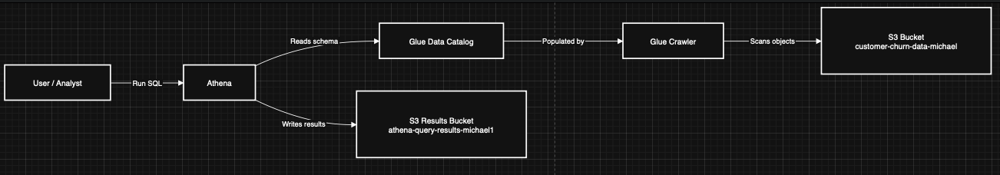

Week 1 — Data Pipeline Project
📌 Overview

This project demonstrates building a simple data pipeline on AWS as part of my cloud engineering learning path.
The goal is to ingest raw data, catalog it for querying, and prepare it for future analytics.

Key AWS services used:
S3 — raw data storage
Glue — crawler and Data Catalog
Athena — query engine (coming next)

✅ Accomplishments

Day 1 — Secure & Cost Control Setup
Set up AWS Budgets & billing alerts
Enabled IAM best practices: created admin user (no root), enabled MFA
Deliverables: AWS budget alerts + secure IAM admin in place

Day 2 — S3 Bucket & Data Upload
Created S3 bucket: customer-churn-data-michael
Uploaded the customer churn dataset (CSV)
Verified dataset upload in S3 console
Deliverables: raw dataset stored securely in S3

Day 3 — Glue Crawler & Data Catalog
Created Glue database: churn_db
Built Glue Crawler to scan S3 bucket and infer schema
Verified creation of customer_churn table in Glue Data Catalog
Deliverables: dataset schema registered in Glue, ready for Athena queries

Screenshots

All screenshots are stored in the folder

Next Steps

Day 4: Run queries in Athena against churn dataset
Day 5: Visualize data using Amazon QuickSight
Day 6: Automate ETL job in AWS Glue
Day 7: Document learnings and architecture diagram

## Day 4 — Query Data with Athena
- Connected Athena to Glue Data Catalog
- Created S3 bucket for Athena query results (`athena-query-results-michael1`)
- Ran SQL queries against churn dataset
- Verified query results in Athena

### Screenshots
- Athena query result bucket in S3
- SQL query in Athena editor
- Query data preview
- Query result output

## Day 5 — Athena Queries for Churn Analysis

On Day 5, I queried the churn dataset in **Amazon Athena** to extract insights.

### Queries & Results
- **Churn by Gender**
  ```sql
  SELECT gender, Churn, COUNT(*) AS total
  FROM customer_churn_data_michael
  GROUP BY gender, Churn
  ORDER BY gender, total DESC;

## Architecture



