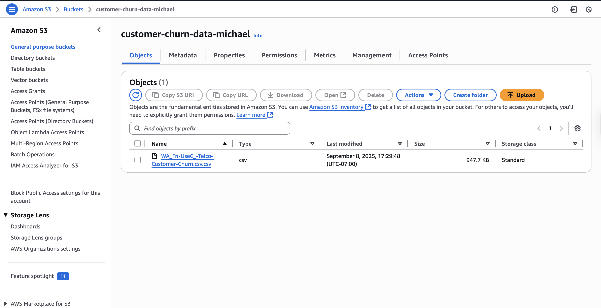
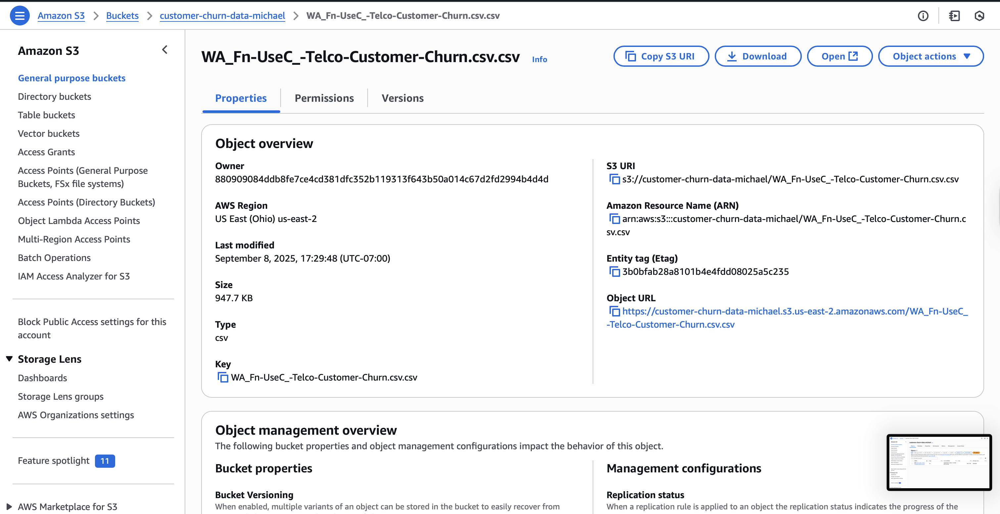
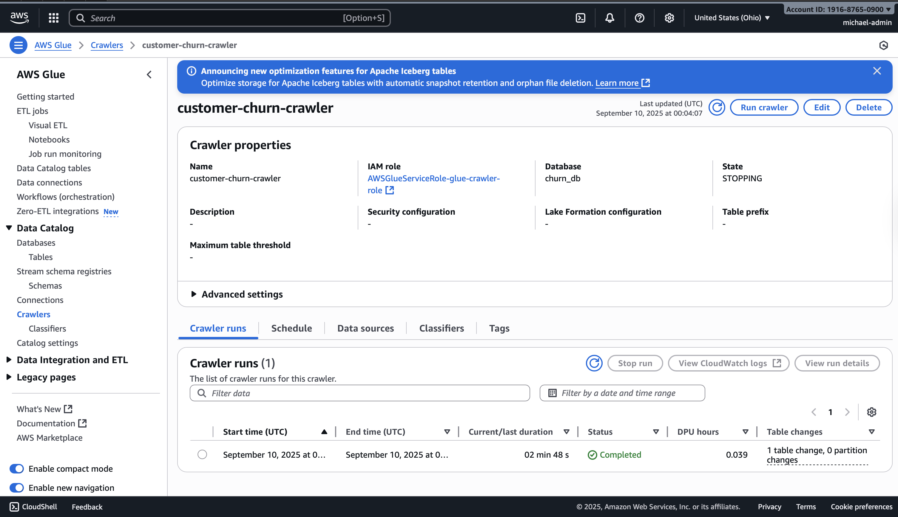
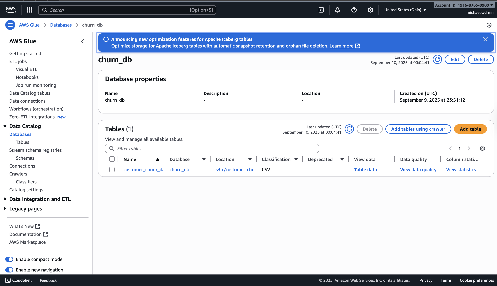
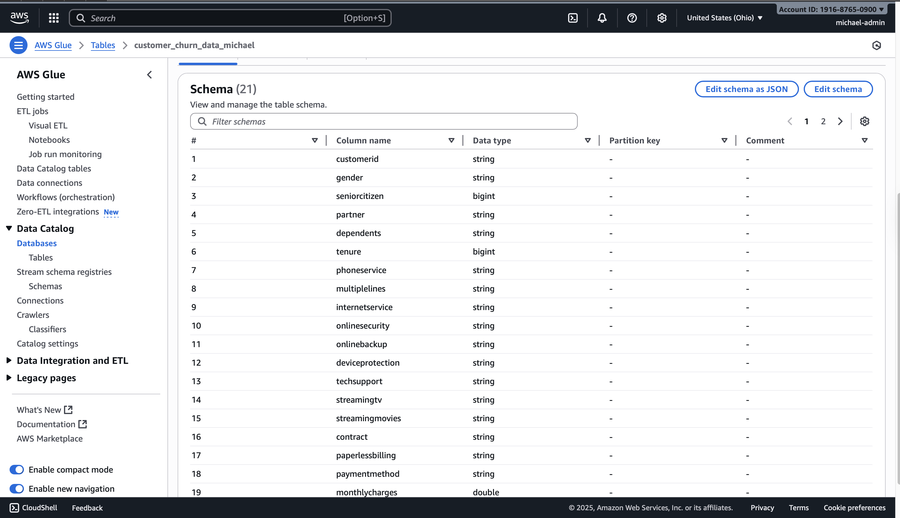

# Week 1 – Data Pipeline Project

## Day 2
- Created S3 bucket `customer-churn-data-michael`
- Uploaded churn dataset (CSV)
- Verified upload in S3

### Screenshots

---

## Day 3
- Set up AWS Glue Database `churn_db`
- Created Glue Crawler for S3 bucket
- IAM Role: `AWSGlueServiceRole-glue-crawler-role`
- Ran crawler and verified table schema

### Screenshots

